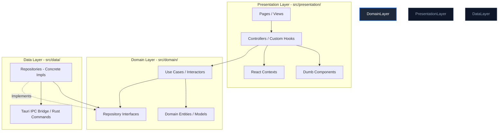

# Clean Architecture & SOLID Rules

This project follows **Clean Architecture** and **SOLID** principles to ensure absolute separation of concerns, high testability, scalability, and maintainability. All code contributions—both in the React Frontend (`src/`) and the Rust/Tauri Backend (`src-tauri/`)—must strictly adhere to these rules.

---

## 1. Architectural Overview & Dependency Flow

The fundamental rule of Clean Architecture is the **Dependency Rule**: *dependencies must always point inwards, towards the Domain layer*. 

High-level policy (Domain) must never depend on low-level details (Data, Tauri APIs, React components, CSS, external libraries).



---

## 2. SOLID Principles Integration

### **S - Single Responsibility Principle (SRP)**
* **Use Cases**: Each use case or method must represent a **single business transaction** or action (e.g., `stageFiles`, `commit`).
  * *Pragmatic Grouping*: While strict Clean Architecture suggests one file per Use Case, related operations may be grouped inside a cohesive service/facade (e.g., `SourceControlUseCases`) to avoid class explosion, but each method must remain highly focused and single-purpose.
* **React Components**: A component should have exactly one reason to change: its visual representation. Business logic and state coordination must be delegated to **Controllers (custom hooks)**.
* **Rust Services**: Keep core service modules separated by context (e.g., repository service, commit service, branch/rebase service).

### **O - Open/Closed Principle (OCP)**
* **Extensibility**: Write code that is open for extension but closed for modification. 
  * Avoid adding massive `switch` or `if-else` blocks when introducing new visual actions or Git operations.
  * *Frontend*: Extend behavior by creating polymorphic UI layouts or composing hooks.
  * *Backend*: In Rust, leverage **Traits** and **Enums** with pattern matching to handle polymorphism safely and compiler-guaranteed extensions.

### **L - Liskov Substitution Principle (LSP)**
* **Substitutability**: Concrete implementations of interfaces (e.g., `TauriGitRepository`) must fully satisfy all contracts defined by their abstractions (`IGitRepository`).
  * A concrete implementation must **never** throw unexpected implementation-specific exceptions (like raw `TauriError` or `git2::Error`) that break the signature expectations of the domain.
  * Any mock repositories used during unit testing must behave identically to production repositories.

### **I - Interface Segregation Principle (ISP)**
* **Focused Contracts**: Do not force clients (components or use cases) to depend on interface methods they do not use.
  * Keep React Component Props strictly limited to what the component actually needs to render.
  * If a Domain Repository interface grows too large, segregate it into smaller, cohesive interfaces (e.g., separate read queries from write commands, or separate branch operations from file staging operations) where appropriate.

### **D - Dependency Inversion Principle (DIP)**
* **Depend on Abstractions**: High-level modules (Presentation/UI) must not depend on low-level modules (Data/Tauri API). They must both depend on abstractions (Domain Interfaces).
* > [!CAUTION]
  > **Domain Purity Rule**: The Domain Layer (`src/domain/`) **MUST NOT** import or depend on the Data Layer (`src/data/`) or the Presentation Layer (`src/presentation/`). 
* > [!IMPORTANT]
  > **Composition Root (DI Container)**: The Dependency Injection Container (e.g., `Container.ts`) is the only place allowed to violate structural isolation because it must import both the Domain interfaces/use cases and concrete Data implementations to wire them together.
  > * **Location Rule**: To prevent domain corruption, the DI Container must **NEVER** reside inside `src/domain/di/`. It should be placed in `src/presentation/di/` or a root-level `src/di/` folder, ensuring the Domain folder remains completely pure (dependency-free).

---

## 3. Frontend Layer Specifications (`src/`)

### **3.1. Domain Layer (`src/domain/`)**
* **Goal**: Core business logic and rules. Unaffected by Tauri version changes, UI frameworks, or translation engines.
* **Entities**: Pure TypeScript models (e.g., `Commit`, `GitBranch`, `Repository`). No external library annotations or framework integrations.
* **Repository Interfaces**: Abstract definitions of data access (e.g., `IGitRepository`).
* **Use Cases**: Orchestrate business logic. They receive repositories via constructor dependency injection and execute rules.

### **3.2. Data Layer (`src/data/`)**
* **Goal**: Handle actual data persistence and communication with the Tauri IPC bridge.
* **Repositories**: Concrete classes (e.g., `TauriGitRepository`) implementing domain interfaces. They invoke Tauri commands and map raw, unstable Tauri DTOs into stable Domain Entities.
* > [!TIP]
  > **Anti-Corruption Layer**: Use mapping functions in the Data Layer to translate raw backend payloads into clean Domain models, insulating the Domain from Tauri/Rust serialization updates.

### **3.3. Presentation Layer (`src/presentation/`)**
* **Pages**: Top-level route components. They connect UI events to hooks/controllers and lay out components.
* **Controllers (Custom Hooks)**: The brain of the UI.
  * Custom hooks (e.g., `useGitActions`) manage loading, error, and UI states.
  * They inject and trigger Domain Use Cases.
  * **Rule**: They must never invoke the Tauri API or read repositories directly. They always go through Use Cases.
* **Components**: Reusable, presentational-only ("dumb") React components.
  * They receive data via `props` and emit events through callback parameters.
  * They have no awareness of Tauri, Use Cases, or Repositories.
* **No Hardcoded User-Facing Text**:
  * ALL user-facing text must be translated using the `useTranslation()` hook from `react-i18next`.
  * Define translation keys in `src/locales/en/translation.json` and `src/locales/es/translation.json`.

---

## 4. Backend Layer Specifications (`src-tauri/src/`)

### **4.1. API Layer (`commands.rs`)**
* **Role**: Gateway for frontend IPC messages.
* **Rule**: Thin wrappers. Validate basic JSON payloads, invoke the Service Layer, map internal Rust errors into Tauri-friendly serialized error strings, and return results. **No business logic or direct Git operations are allowed here.**

### **4.2. Service Layer (`services.rs`)**
* **Role**: Core Rust business logic (Git tree generation, staging, committing).
* **Dependencies**: Can utilize libraries like `git2` to interface with the operating system. Must be structurally testable with standard Rust unit/integration tests.

### **4.3. Models (`models.rs`)**
* **Role**: Pure Data Transfer Objects (DTOs) shared across the backend. Should include `Serialize`/`Deserialize` derivations.

### **4.4. Entry Point (`lib.rs` / `main.rs`)**
* **Role**: Wiring and application bootstrapping. Keep this file minimal.

---

## 5. Error & Data Boundaries

To prevent leaking infrastructure implementation details, error propagation must obey the **Dependency Inversion** boundary:

```text
[Rust Backend]             [Tauri Bridge]            [Data Layer]              [Domain / Presentation]
Raw OS / git2 Errors  --->  Tauri IPC Failures  --->  Map to Domain Errors  --->  Safe/Translated UI Alerts
(e.g., libgit2 fail)        (JSON/String err)         (e.g., NetworkError)        (Friendly translation keys)
```

1. **Mapping**: Low-level errors (e.g., `git2::Error`) must be caught and mapped to domain-specific error structures in the Data Layer.
2. **Translation**: The Presentation layer receives clean, predictable Domain errors and maps them to user-friendly translated strings using `i18next`. Never render raw Rust error payloads directly in the UI.
